<p align="center">
  
</p>

<p align="center">
  <a href="https://api.atria-asi.ai/console"></a>
</p>

<p align="center">
  <a href="https://hub.docker.com/r/nousresearch/hermes-agent"></a>
  <a href="https://railway.app"></a>
  <a href="https://telegram.org"></a>
  <a href="https://discord.com/developers/docs"></a>
  <a href="https://api.atria-asi.ai/console"></a>
  <a href="LICENSE"></a>
</p>

<p align="center">
  <a href="README.md">Bahasa Indonesia</a> · <b>English</b>
</p>

<p align="center">
  <b>A personal AI bot for Telegram and Discord, deployed on Railway and powered by Atria.</b><br>
  Runs the official Hermes Agent from Nous Research, no fork and no patches.<br>
  Fill in a few Railway Variables, deploy, and start chatting.
</p>

<p align="center">
  <a href="#features">Features</a> ·
  <a href="#how-it-works">How it works</a> ·
  <a href="#quick-start">Quick start</a> ·
  <a href="#environment-variables">Environment</a> ·
  <a href="#chat-commands">Commands</a> ·
  <a href="#security">Security</a> ·
  <a href="#troubleshooting">Troubleshooting</a> ·
  <a href="#faq">FAQ</a>
</p>

---

## Features

- **Official Hermes Agent.** Built on `nousresearch/hermes-agent:latest`; this repo only ships the deployment config.
- **Telegram and Discord at once.** One service, two chat platforms.
- **One provider, one model, zero fallback.** Atria with `Atria-Dawn-Preview`, nothing else to configure or debug.
- **Few variables to set.** Provider, model, timezone, and Discord flags are hardcoded in the `Dockerfile`; only secrets and IDs go into Railway Variables.
- **Persistent data.** Data is kept on a Railway Volume mounted at `/opt/data`, so it survives redeploys.
- **Allow-lists built in.** Only the Telegram/Discord users and channels you list can talk to the bot.
- **Chat commands.** Switch models, hide reasoning, reset sessions, check token usage, and more, straight from the chat.

## How it works

<p align="center">
  
</p>

Hermes talks to Atria through its OpenAI-compatible endpoint:

```
https://api.atria-asi.ai/v1
```

The Hermes config uses a custom provider:

```yaml
providers:
  atria:
    api: https://api.atria-asi.ai/v1
    key_env: ATRIA_API_KEY

model:
  default: Atria-Dawn-Preview
  provider: custom:atria
```

There is **no fallback provider** in this setup.

> ⚠️ **Atria Dawn Preview accepts text input only.** If you send a photo or attachment to the bot,
> the request will most likely be rejected by the endpoint with a `400` error.

## Quick start

<p align="center">
  
</p>

> ⚠️ Do **not** use Railway's "Deploy a Docker Image" option.
> Deploy from a **GitHub repo** that contains the `Dockerfile`, and let the Dockerfile decide how the process starts.
> **Leave the Custom Start Command empty.**

### Step 1: Create the Telegram bot

1. Open **BotFather** in Telegram.
2. Send `/newbot` and follow the prompts.
3. Save the **Bot Token**.
4. Use a "user info" bot to find your own Telegram **User ID**.

### Step 2: Create the Discord bot

1. Open the **Discord Developer Portal** and create a **New Application**.
2. Go to **Bot**, then create or reset the **Bot Token**.
3. Enable **Message Content Intent** and **Server Members Intent**.
4. In Discord, turn on **Developer Mode** and copy your **User ID**.
5. Under **OAuth2 → URL Generator**, select `bot` and `applications.commands`.
6. Grant the permissions you need, for example *Send Messages*, *Read Message History*, and *Attach Files*.
7. Invite the bot to your server and copy the **Channel ID** of the channel you want to use.

### Step 3: Create an Atria API key

1. Open `https://api.atria-asi.ai/console` and sign in or sign up.
2. Go to the API keys section and create a new key (usually formatted `atr_...` and shown only once).
3. Copy it and store it somewhere safe.

**Never put the API key in the Dockerfile.**

### Step 4: Push the repo to GitHub

Create a repository (private is recommended) and upload the files from the [project structure](#project-structure) to the root.

### Step 5: Deploy to Railway

1. In Railway, choose **New Project → Deploy from GitHub repo** and select your repository.
2. Add a **Volume** to the service with the mount path `/opt/data`.
3. Open **Variables** and paste the values from [Environment variables](#environment-variables).
4. Go to **Settings → Deploy** and make sure the **Custom Start Command is empty**.
5. Deploy (or redeploy), then open **View Logs**.

If everything is fine, the startup script prints:

```
========================================
HERMES MODEL CONFIG
========================================

PRIMARY:
  atria
  Atria-Dawn-Preview

FALLBACKS:
  (none)

========================================
```

Wait until the Telegram and Discord gateways report that they are connected, then message your bot.

## Environment variables

<p align="center">
  
</p>

Paste this into **Railway → Variables → Raw Editor** and replace every placeholder:

```bash
# ===== ATRIA =====
ATRIA_API_KEY=replace-with-your-atria-api-key

# ===== TELEGRAM =====
TELEGRAM_BOT_TOKEN=replace-with-botfather-token
TELEGRAM_HOME_CHANNEL=replace-with-your-telegram-user-id
TELEGRAM_HOME_CHANNEL_NAME=Any Name
TELEGRAM_ALLOWED_USERS=replace-with-your-telegram-user-id

# ===== DISCORD =====
DISCORD_BOT_TOKEN=replace-with-discord-bot-token
DISCORD_ALLOWED_USERS=replace-with-your-discord-user-id
DISCORD_ALLOWED_CHANNELS=replace-with-channel-id
DISCORD_FREE_RESPONSE_CHANNELS=replace-with-channel-id
```

**No need to set these manually.** They are already defined in the Dockerfile:

```
HERMES_HOME=/opt/data
HERMES_TIMEZONE=Asia/Jakarta
DISCORD_AUTO_THREAD=false
DISCORD_TOOL_PROGRESS=off
```

**Groq and Gemini variables are no longer used.** Delete them if they are still around:

```
GROQ_API_KEY=
GOOGLE_API_KEY=
```

## Provider and model

| Order   | Provider | Model              | Model ID             |
| ------- | -------- | ------------------ | -------------------- |
| Primary | Atria    | Atria Dawn Preview | `Atria-Dawn-Preview` |

Atria Dawn Preview is an agentic model (MoE, about 744B parameters) built for continuous
environment understanding, tool use, and multi-step tasks such as research, coding,
document and report writing, and security analysis.

**About usage limits.** Atria may still enforce its own rate limits or quotas, even if some
access to this model is currently listed as free. Check the Atria console for the latest
limits, since the policy can change at any time. When you go over, the API can return
`HTTP 429 Too Many Requests`.

## Chat commands

Use these in Telegram or Discord:

| Command                             | What it does                  |
| ----------------------------------- | ----------------------------- |
| `/model`                            | Show the active model         |
| `/model <id> --provider <provider>` | Switch model manually         |
| `/reasoning show`                   | Show the model's reasoning    |
| `/reasoning hide`                   | Hide the model's reasoning    |
| `/sethome`                          | Make this chat the home channel |
| `/new`                              | Start a new session           |
| `/reset`                            | Reset the session             |
| `/status`                           | Show session status           |
| `/usage`                            | Show token usage              |
| `/help`                             | List available commands       |

For the Atria custom provider the model format is:

```
/model custom:atria:Atria-Dawn-Preview
```

`custom:<provider>:<model>` is the format Hermes uses for OpenAI-compatible providers such as Atria.

## Security

**Never commit an API key or bot token to GitHub.** Do not put any of these in the `Dockerfile`:

```
ATRIA_API_KEY
TELEGRAM_BOT_TOKEN
DISCORD_BOT_TOKEN
```

Keep them in **Railway → Variables** instead. A **private repository** is also recommended for a personal bot.

If a key or token leaks:

1. Revoke or delete the old credential.
2. Create a new one.
3. Update the value in Railway Variables.
4. Redeploy the service.

## Troubleshooting

| Problem                            | Fix                                                                           |
| ---------------------------------- | ----------------------------------------------------------------------------- |
| Container exits immediately        | Check Railway Variables for typos                                             |
| `Permission denied` on `/opt/data` | Deploy from the GitHub repo + Dockerfile and use the mount path `/opt/data`   |
| Telegram bot does not reply        | Check `TELEGRAM_ALLOWED_USERS` and `TELEGRAM_HOME_CHANNEL`                    |
| Discord bot does not reply         | Check `DISCORD_ALLOWED_CHANNELS` and `DISCORD_ALLOWED_USERS`                  |
| `401` error                        | Check `ATRIA_API_KEY`                                                         |
| `403` error                        | Check the API key and your access to the Atria endpoint                       |
| `429` error                        | Atria rate limit or quota reached; wait for the reset or check your plan      |
| `400` error when sending an image  | Atria Dawn Preview does not accept images; send text only                     |
| `Model not found`                  | Re-check the model ID listed in the Atria console                             |
| Reasoning shows up in chat         | Run `/reasoning hide`                                                         |
| Volume does not keep data          | Make sure the mount path is exactly `/opt/data`                               |
| Groq/Gemini still appear in logs   | Remove the old keys and config, then redeploy the latest image                |

## Project structure

```
my-hermes-agent/
├── Dockerfile        # Build + provider/model configuration
├── railway.toml      # Railway deploy configuration
├── .gitignore        # Keeps secret files out of Git (recommended)
├── LICENSE           # MIT
├── README.md         # Indonesian version (default)
├── README.en.md      # This file (English)
└── assets/           # README images (SVG): id/ and en/
```

## Known limitations

- **Text only.** Atria Dawn Preview does not accept images; attachments sent through Telegram or Discord can fail with a `400`.
- **Preview model.** Behavior, availability, and limits may change as Atria updates it.
- **Single provider.** With no fallback, a problem on Atria's side means the bot cannot answer until it is resolved.
- **Quotas can change.** Always check the Atria console for current limits.

## FAQ

<details>
<summary><b>Why Atria?</b></summary>

Atria offers an OpenAI-compatible Chat Completions endpoint that Hermes can use through a
custom provider, with `api: https://api.atria-asi.ai/v1`, `ATRIA_API_KEY`, and `provider: custom:atria`.
</details>

<details>
<summary><b>Is this the official Hermes Agent?</b></summary>

Yes. The image used is:

```
nousresearch/hermes-agent:latest
```

This repo only provides deployment configuration. Hermes Agent itself comes from Nous Research.
</details>

<details>
<summary><b>Is there a fallback provider?</b></summary>

No. The setup deliberately uses only:

```
Atria
└── Atria-Dawn-Preview
```

There is no Groq, Gemini, OpenRouter, Claude, DeepSeek, or OpenCode Zen fallback.
</details>

<details>
<summary><b>Can I switch to another Atria model?</b></summary>

Yes, if Atria adds more models to its catalog. Change this block:

```python
cfg["model"] = {
    "default": "Atria-Dawn-Preview",
    "provider": "custom:atria"
}
```

and make sure the new model exists in the Atria console first.
</details>

<details>
<summary><b>Is Atria Dawn Preview good for coding?</b></summary>

Yes. It is designed for agentic work with reasoning, tool use, code implementation,
running experiments, and analyzing and fixing results, including software engineering scenarios.
</details>

<details>
<summary><b>Does it accept images?</b></summary>

No, text only. If the bot forwards an image attachment from Telegram or Discord to the model,
the request fails with a `400`.
</details>

<details>
<summary><b>Is Atria really limitless?</b></summary>

Not necessarily. Rate limits and quotas can change at any time. Check the official console
(`https://api.atria-asi.ai/console`) for the latest information.
</details>

<details>
<summary><b>Why are the provider and model hardcoded in the Dockerfile?</b></summary>

Because they are not secrets. Hardcoding them means fewer variables to fill in on Railway,
while the real credentials stay private in Railway Variables.
</details>

## Final configuration

<p align="center">
  
</p>

## References

- Hermes Agent: provider documentation
- Atria: console and API docs (`https://api.atria-asi.ai/console`)
- Railway: deployment documentation

## License

Released under the [MIT License](LICENSE).
