<p align="center">
  
</p>

<p align="center">
  🇬🇧 <a href="README.md">English</a> &nbsp;·&nbsp; 🇮🇩 <b>Bahasa Indonesia</b>
</p>

# Hermes Agent

**Bot AI pribadi untuk Telegram dan Discord, di-deploy di Railway dan ditenagai Atria.**
Menjalankan [Hermes Agent](https://github.com/NousResearch/hermes-agent) resmi dari
Nous Research (bukan fork, tanpa modifikasi) dengan **Atria Dawn Preview** sebagai satu-satunya model.
Fork atau clone repo ini, isi beberapa Railway Variables, deploy, lalu langsung ngobrol.

## Fitur

- **Hermes Agent resmi.** Memakai `nousresearch/hermes-agent:latest`; repo ini hanya berisi konfigurasi deployment.
- **Telegram dan Discord sekaligus.** Satu service, dua platform chat.
- **Satu provider, satu model, tanpa fallback.** Atria dengan `Atria-Dawn-Preview`, tidak ada yang rumit untuk diatur atau di-debug.
- **Variable yang diisi sedikit.** Provider, model, timezone, dan pengaturan Discord sudah di-hardcode di `Dockerfile`; hanya rahasia dan ID yang masuk ke Railway Variables.
- **Data persisten.** Data disimpan di Railway Volume pada `/opt/data`, jadi tetap ada setelah redeploy.
- **Allow-list bawaan.** Hanya user dan channel Telegram/Discord yang kamu daftarkan yang bisa mengobrol dengan bot.
- **Command di chat.** Ganti model, sembunyikan reasoning, reset sesi, lihat pemakaian token, dan lainnya langsung dari chat.

## Cara kerja

<p align="center">
  
</p>

Hermes terhubung ke Atria lewat endpoint yang kompatibel dengan OpenAI:

```
https://api.atria-asi.ai/v1
```

Konfigurasi Hermes memakai custom provider:

```yaml
providers:
  atria:
    api: https://api.atria-asi.ai/v1
    key_env: ATRIA_API_KEY

model:
  default: Atria-Dawn-Preview
  provider: custom:atria
```

**Tidak ada fallback provider** dalam konfigurasi ini.

> ⚠️ **Atria Dawn Preview hanya menerima input teks.** Jika kamu mengirim foto atau attachment ke bot,
> permintaan itu kemungkinan besar akan ditolak endpoint dengan error `400`.

## Mulai cepat

<p align="center">
  
</p>

> ⚠️ **Jangan** pakai opsi "Deploy a Docker Image" di Railway.
> Deploy dari **GitHub repo** yang berisi `Dockerfile`, dan biarkan Dockerfile yang menentukan proses startup.
> **Kosongkan Custom Start Command.**

### Langkah 1: Buat bot Telegram

1. Buka **BotFather** di Telegram.
2. Kirim `/newbot` dan ikuti instruksinya.
3. Simpan **Bot Token**.
4. Pakai bot informasi user untuk mengetahui **User ID** Telegram kamu.

### Langkah 2: Buat bot Discord

1. Buka **Discord Developer Portal** dan buat **New Application**.
2. Masuk ke bagian **Bot**, lalu buat atau reset **Bot Token**.
3. Aktifkan **Message Content Intent** dan **Server Members Intent**.
4. Di Discord, aktifkan **Developer Mode** dan salin **User ID** kamu.
5. Di **OAuth2 → URL Generator**, pilih `bot` dan `applications.commands`.
6. Berikan permission yang diperlukan, misalnya *Send Messages*, *Read Message History*, dan *Attach Files*.
7. Invite bot ke server, lalu salin **Channel ID** channel yang akan dipakai.

### Langkah 3: Buat API key Atria

1. Buka `https://api.atria-asi.ai/console`, lalu login atau daftar.
2. Masuk ke bagian API key dan buat key baru (biasanya berformat `atr_...` dan hanya ditampilkan sekali).
3. Salin dan simpan dengan aman.

**Jangan masukkan API key langsung ke Dockerfile.**

### Langkah 4: Upload repo ke GitHub

Buat repository (disarankan **private**) lalu upload file-file dari [struktur repo](#struktur-repo) ke root.

### Langkah 5: Deploy ke Railway

1. Di Railway, pilih **New Project → Deploy from GitHub repo**, lalu pilih repository kamu.
2. Tambahkan **Volume** ke service dengan mount path `/opt/data`.
3. Buka **Variables** dan masukkan nilai dari bagian [Environment variables](#environment-variables).
4. Buka **Settings → Deploy** dan pastikan **Custom Start Command kosong**.
5. Deploy (atau redeploy), lalu buka **View Logs**.

Jika berhasil, startup script akan menampilkan:

```
========================================
HERMES MODEL CONFIG
========================================

PRIMARY:
  atria
  Atria-Dawn-Preview

FALLBACKS:
  (tidak ada)

========================================
```

Tunggu sampai gateway Telegram dan Discord terhubung, lalu kirim pesan ke bot kamu.

## Environment variables

<p align="center">
  
</p>

Tempel ini di **Railway → Variables → Raw Editor** dan ganti semua placeholder:

```bash
# ===== ATRIA =====
ATRIA_API_KEY=ganti-api-key-atria

# ===== TELEGRAM =====
TELEGRAM_BOT_TOKEN=ganti-token-botfather
TELEGRAM_HOME_CHANNEL=ganti-user-id-kamu
TELEGRAM_HOME_CHANNEL_NAME=Nama Bebas
TELEGRAM_ALLOWED_USERS=ganti-user-id-kamu

# ===== DISCORD =====
DISCORD_BOT_TOKEN=ganti-token-discord
DISCORD_ALLOWED_USERS=ganti-discord-user-id
DISCORD_ALLOWED_CHANNELS=ganti-channel-id
DISCORD_FREE_RESPONSE_CHANNELS=ganti-channel-id
```

**Tidak perlu diisi manual.** Nilai berikut sudah diatur di Dockerfile:

```
HERMES_HOME=/opt/data
HERMES_TIMEZONE=Asia/Jakarta
DISCORD_AUTO_THREAD=false
DISCORD_TOOL_PROGRESS=off
```

**Variable Groq dan Gemini tidak digunakan lagi.** Hapus jika masih ada:

```
GROQ_API_KEY=
GOOGLE_API_KEY=
```

## Provider dan model

| Urutan | Provider | Model              | Model ID             |
| ------ | -------- | ------------------ | -------------------- |
| Utama  | Atria    | Atria Dawn Preview | `Atria-Dawn-Preview` |

Atria Dawn Preview adalah model agentic (MoE, sekitar 744B parameter) yang ditujukan untuk
pemahaman lingkungan berkelanjutan, penggunaan tool, dan tugas multi-langkah seperti riset,
coding, pembuatan dokumen/laporan, hingga analisis keamanan.

**Tentang batas penggunaan.** Atria kemungkinan tetap memiliki rate limit atau quota sendiri,
meskipun saat ini beberapa akses ke model ini tercatat gratis. Cek console Atria untuk limit
terbaru karena kebijakannya bisa berubah sewaktu-waktu. Jika melewati limit, API dapat
mengembalikan `HTTP 429 Too Many Requests`.

## Command di chat

Bisa dipakai lewat Telegram atau Discord:

| Command                             | Fungsi                               |
| ----------------------------------- | ------------------------------------ |
| `/model`                            | Melihat model yang aktif             |
| `/model <id> --provider <provider>` | Mengganti model secara manual        |
| `/reasoning show`                   | Menampilkan reasoning                |
| `/reasoning hide`                   | Menyembunyikan reasoning             |
| `/sethome`                          | Menjadikan chat sebagai home channel |
| `/new`                              | Memulai sesi baru                    |
| `/reset`                            | Mereset sesi                         |
| `/status`                           | Melihat status sesi                  |
| `/usage`                            | Melihat penggunaan token             |
| `/help`                             | Melihat command yang tersedia        |

Untuk custom provider Atria, format modelnya:

```
/model custom:atria:Atria-Dawn-Preview
```

Format `custom:<provider>:<model>` adalah format yang dipakai Hermes untuk provider yang
kompatibel dengan OpenAI seperti Atria.

## Keamanan

**Jangan pernah commit API key atau bot token ke GitHub.** Jangan masukkan ini ke `Dockerfile`:

```
ATRIA_API_KEY
TELEGRAM_BOT_TOKEN
DISCORD_BOT_TOKEN
```

Simpan di **Railway → Variables**. **Repository private** juga lebih disarankan untuk bot pribadi.

Jika API key atau bot token terlanjur bocor:

1. Revoke atau hapus credential lama.
2. Buat credential baru.
3. Ganti value di Railway Variables.
4. Redeploy service.

## Troubleshooting

| Masalah                            | Solusi                                                                        |
| ---------------------------------- | ----------------------------------------------------------------------------- |
| Container exit langsung            | Periksa Railway Variables, pastikan tidak ada typo                            |
| `Permission denied` di `/opt/data` | Pakai GitHub repo + Dockerfile dan Mount Path `/opt/data`                     |
| Bot Telegram tidak membalas        | Periksa `TELEGRAM_ALLOWED_USERS` dan `TELEGRAM_HOME_CHANNEL`                  |
| Bot Discord tidak membalas         | Periksa `DISCORD_ALLOWED_CHANNELS` dan `DISCORD_ALLOWED_USERS`                |
| Error `401`                        | Periksa `ATRIA_API_KEY`                                                       |
| Error `403`                        | Periksa API key dan akses endpoint Atria                                      |
| Error `429`                        | Rate limit/quota Atria tercapai; tunggu reset atau cek plan di console        |
| Error `400` saat kirim gambar      | Atria Dawn Preview tidak menerima gambar, kirim teks saja                     |
| `Model not found`                  | Periksa kembali model ID yang tersedia di console Atria                       |
| Reasoning muncul di chat           | Jalankan `/reasoning hide`                                                    |
| Volume tidak menyimpan data        | Pastikan Mount Path tepat `/opt/data`                                         |
| Groq/Gemini masih muncul di log    | Hapus API key dan konfigurasi lama, lalu redeploy image terbaru               |

## Struktur repo

```
my-hermes-agent/
├── Dockerfile        # Build + konfigurasi provider/model
├── railway.toml      # Konfigurasi deploy Railway
├── .gitignore        # Mencegah file rahasia ikut ter-upload (disarankan)
├── LICENSE           # MIT
├── README.md         # Dokumentasi bahasa Inggris
├── README.id.md      # Dokumen ini (bahasa Indonesia)
└── assets/           # Gambar README (SVG)
```

## Batasan yang diketahui

- **Hanya teks.** Atria Dawn Preview tidak menerima gambar; attachment dari Telegram atau Discord bisa gagal dengan error `400`.
- **Model preview.** Perilaku, ketersediaan, dan limit bisa berubah seiring pembaruan dari Atria.
- **Satu provider.** Tanpa fallback, jika Atria bermasalah maka bot tidak bisa menjawab sampai masalahnya selesai.
- **Quota bisa berubah.** Selalu cek console Atria untuk limit terbaru.

## FAQ

<details>
<summary><b>Kenapa memakai Atria?</b></summary>

Atria menyediakan endpoint Chat Completions yang kompatibel dengan OpenAI dan bisa dipakai
Hermes lewat custom provider, dengan `api: https://api.atria-asi.ai/v1`, `ATRIA_API_KEY`,
dan `provider: custom:atria`.
</details>

<details>
<summary><b>Apakah ini Hermes Agent versi resmi?</b></summary>

Ya. Image yang digunakan:

```
nousresearch/hermes-agent:latest
```

Repo ini hanya menyediakan konfigurasi deployment. Hermes Agent tetap berasal dari Nous Research.
</details>

<details>
<summary><b>Apakah ada fallback provider lain?</b></summary>

Tidak. Konfigurasi ini sengaja hanya memakai:

```
Atria
└── Atria-Dawn-Preview
```

Tidak ada fallback Groq, Gemini, OpenRouter, Claude, DeepSeek, maupun OpenCode Zen.
</details>

<details>
<summary><b>Apakah bisa mengganti model Atria?</b></summary>

Bisa, jika Atria menambah model lain di katalognya. Ubah blok ini:

```python
cfg["model"] = {
    "default": "Atria-Dawn-Preview",
    "provider": "custom:atria"
}
```

dan pastikan model baru itu tersedia di console Atria.
</details>

<details>
<summary><b>Apakah Atria Dawn Preview cocok untuk coding?</b></summary>

Ya. Model ini dirancang untuk tugas agentic dengan kemampuan reasoning, penggunaan tool,
implementasi kode, eksekusi eksperimen, hingga analisis dan perbaikan hasil, termasuk
skenario software engineering.
</details>

<details>
<summary><b>Apakah menerima gambar?</b></summary>

Tidak, hanya teks. Jika bot meneruskan attachment gambar dari Telegram atau Discord ke model,
permintaan akan gagal dengan error `400`.
</details>

<details>
<summary><b>Apakah Atria benar-benar tanpa limit?</b></summary>

Belum tentu. Kebijakan rate limit/quota bisa berubah sewaktu-waktu. Selalu cek console resmi
(`https://api.atria-asi.ai/console`) untuk informasi terbaru.
</details>

<details>
<summary><b>Kenapa provider dan model di-hardcode di Dockerfile?</b></summary>

Karena keduanya bukan data rahasia. Dengan di-hardcode, jumlah variable yang harus diisi di
Railway jadi lebih sedikit, sementara credential rahasia tetap aman di Railway Variables.
</details>

## Konfigurasi akhir

<p align="center">
  
</p>

## Referensi

- Hermes Agent: dokumentasi provider
- Atria: console dan dokumentasi API (`https://api.atria-asi.ai/console`)
- Railway: dokumentasi deployment

## Lisensi

Dirilis di bawah [Lisensi MIT](LICENSE).
