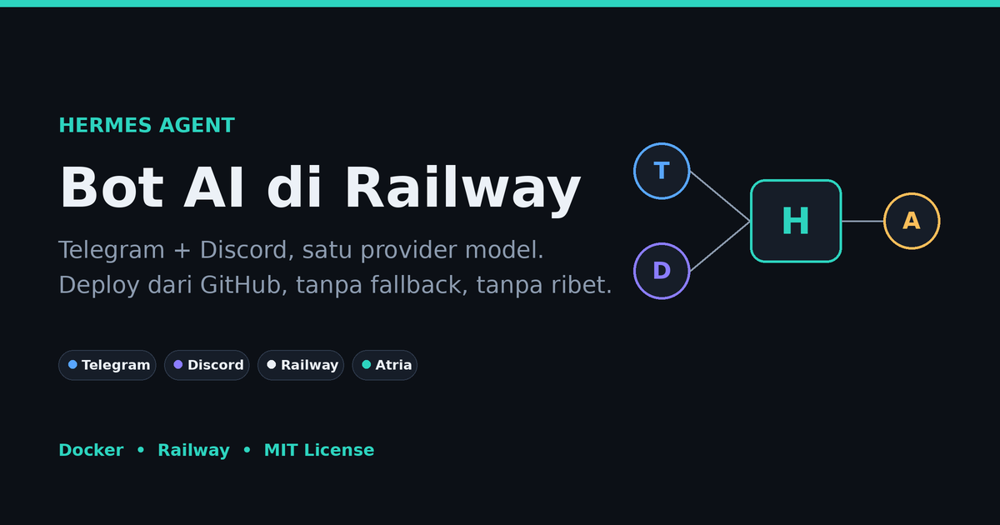
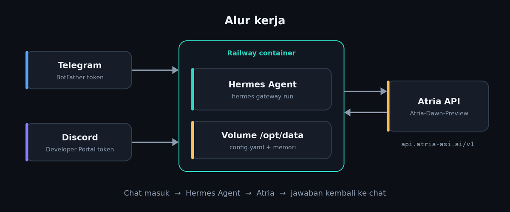

<p align="center">
  
</p>

<p align="center">
  
  
  
  
  
</p>

# Hermes Agent: Telegram & Discord Bot di Railway

Konfigurasi siap deploy untuk menjalankan **[Hermes Agent](https://github.com/NousResearch/hermes-agent)** resmi (Nous Research) sebagai bot pribadi di **Telegram** dan **Discord**, dengan **Atria** (`Atria-Dawn-Preview`) sebagai satu-satunya provider model.

Repo ini hanya berisi konfigurasi deployment. Hermes Agent tidak dimodifikasi dan tetap diambil dari image `nousresearch/hermes-agent:latest`.

---

## 📖 Daftar Isi

1. [Ringkasan](#-ringkasan)
2. [Arsitektur](#-arsitektur)
3. [Konfigurasi Bawaan](#-konfigurasi-bawaan)
4. [Instalasi](#-instalasi)
5. [Environment Variables](#-environment-variables)
6. [Perintah di Chat](#-perintah-di-chat)
7. [Troubleshooting](#-troubleshooting)
8. [Keamanan](#-keamanan)
9. [FAQ](#-faq)
10. [Struktur Repo](#-struktur-repo)
11. [Lisensi dan Atribusi](#-lisensi-dan-atribusi)

---

## 📌 Ringkasan

| | |
|---|---|
| **Agent** | Hermes Agent (`nousresearch/hermes-agent:latest`) |
| **Platform chat** | Telegram dan Discord, berjalan bersamaan |
| **Provider model** | Atria (endpoint OpenAI-compatible), tanpa fallback |
| **Model** | `Atria-Dawn-Preview` |
| **Hosting** | Railway (deploy dari GitHub, Docker) |
| **Penyimpanan** | Railway Volume di `/opt/data` |
| **Zona waktu** | `Asia/Jakarta` |

Provider, model, dan pengaturan teknis lain ditulis tetap di `Dockerfile`. Yang perlu kamu isi di Railway hanya kredensial dan ID akun.

> ⚠️ **Hanya input teks.** Atria Dawn Preview menerima teks saja. Foto atau lampiran yang dikirim ke bot kemungkinan ditolak endpoint dengan error `400`.

## 🧭 Arsitektur

<p align="center">
  
</p>

Chat dari Telegram atau Discord masuk ke Hermes Agent di dalam container Railway. Hermes meneruskan permintaan ke API Atria lewat `chat_completions`, lalu mengirim jawabannya kembali ke chat. Konfigurasi dan memori disimpan di volume `/opt/data`, jadi tetap ada setelah redeploy.

## ⚙️ Konfigurasi Bawaan

Saat container menyala, script startup di `Dockerfile` menulis `config.yaml` di `/opt/data` dengan nilai berikut:

| Pengaturan | Nilai |
|---|---|
| Provider | `custom:atria` (`https://api.atria-asi.ai/v1`, mode `chat_completions`) |
| Model utama | `Atria-Dawn-Preview` |
| Fallback | Tidak ada |
| Reasoning effort | `low` |
| Kompresi riwayat | Aktif, threshold `0.3` (riwayat dipadatkan lebih awal untuk menghemat token) |
| Memori | Aktif, batas `1200` karakter (memori) dan `800` karakter (profil pengguna) |
| `HERMES_HOME` | `/opt/data` |
| `HERMES_TIMEZONE` | `Asia/Jakarta` |
| `DISCORD_AUTO_THREAD` | `false` |
| `DISCORD_TOOL_PROGRESS` | `off` |

Ingin mengubah nilai di atas? Edit blok yang sesuai di `Dockerfile`, commit, lalu redeploy.

## 🚀 Instalasi

### Prasyarat

- Akun [Railway](https://railway.app) dan akun GitHub
- Akun Telegram dan/atau Discord
- API key dari konsol Atria: <https://api.atria-asi.ai/console>

### Langkah 1: Siapkan repository

Fork atau salin repo ini ke akun GitHub kamu. Repo tidak berisi rahasia (semua kredensial ada di Railway Variables), jadi public maupun private sama-sama aman.

### Langkah 2: Buat bot

<details>
<summary><b>Telegram</b></summary>

1. Buka **BotFather** di Telegram dan kirim `/newbot`.
2. Ikuti instruksi sampai bot dibuat, lalu simpan **Bot Token**.
3. Cari **User ID** Telegram kamu lewat bot informasi user (mis. `@userinfobot`).

</details>

<details>
<summary><b>Discord</b></summary>

1. Buka [Discord Developer Portal](https://discord.com/developers/applications) dan buat **New Application**.
2. Masuk ke bagian **Bot**, lalu buat atau reset **Bot Token**.
3. Aktifkan **Message Content Intent** dan **Server Members Intent**.
4. Di aplikasi Discord, aktifkan **Developer Mode** lalu salin **User ID** kamu.
5. Buka **OAuth2 → URL Generator**, pilih scope `bot` dan `applications.commands`.
6. Beri permission: *Send Messages*, *Read Message History*, *Attach Files*.
7. Buka URL yang dihasilkan untuk mengundang bot ke server.
8. Salin **Channel ID** dari channel yang akan dipakai.

</details>

### Langkah 3: Buat API key Atria

1. Masuk ke <https://api.atria-asi.ai/console>.
2. Buka bagian API key dan buat key baru (biasanya berformat `atr_...` dan hanya tampil sekali).
3. Simpan key tersebut. Jangan memasukkannya ke `Dockerfile` atau ke repo.

### Langkah 4: Deploy ke Railway

1. Di Railway pilih **New Project → Deploy from GitHub repo**, lalu pilih repository ini.
2. Tambahkan **Volume** ke service dengan mount path `/opt/data`.
3. Buka tab **Variables → Raw Editor**, lalu isi variabel dari [bagian berikut](#-environment-variables). Template ada di [`.env.example`](.env.example).
4. Buka **Settings → Deploy** dan pastikan **Custom Start Command kosong**.
5. Deploy atau redeploy, lalu buka **View Logs**.

> ⚠️ Jangan memakai opsi **Deploy a Docker Image**. Gunakan repo GitHub berisi `Dockerfile` agar script startup ikut berjalan.

Deploy berhasil jika log menampilkan blok `HERMES MODEL CONFIG` berisi provider `custom:atria` dan model `Atria-Dawn-Preview`, disusul gateway Telegram dan Discord yang terhubung.

## 🔑 Environment Variables

Isi di **Railway → Variables → Raw Editor**.

| Variabel | Wajib | Keterangan |
|---|---|---|
| `ATRIA_API_KEY` | Ya | API key dari konsol Atria |
| `TELEGRAM_BOT_TOKEN` | Ya (Telegram) | Token dari BotFather |
| `TELEGRAM_ALLOWED_USERS` | Ya (Telegram) | User ID Telegram yang boleh memakai bot |
| `TELEGRAM_HOME_CHANNEL` | Disarankan | ID chat tujuan untuk home channel |
| `TELEGRAM_HOME_CHANNEL_NAME` | Opsional | Nama tampilan home channel |
| `DISCORD_BOT_TOKEN` | Ya (Discord) | Token bot dari Developer Portal |
| `DISCORD_ALLOWED_USERS` | Ya (Discord) | User ID Discord yang boleh memakai bot |
| `DISCORD_ALLOWED_CHANNELS` | Ya (Discord) | Channel ID yang boleh dipakai bot |
| `DISCORD_FREE_RESPONSE_CHANNELS` | Opsional | Channel ID tempat bot menjawab tanpa mention |

Variabel `HERMES_HOME`, `HERMES_TIMEZONE`, `DISCORD_AUTO_THREAD`, dan `DISCORD_TOOL_PROGRESS` sudah diatur di `Dockerfile`, tidak perlu diisi manual. `GROQ_API_KEY` dan `GOOGLE_API_KEY` tidak dipakai lagi, hapus jika masih ada.

## 💬 Perintah di Chat

Bisa dipakai di Telegram maupun Discord.

| Perintah | Fungsi |
|---|---|
| `/model` | Melihat model yang aktif |
| `/model custom:atria:Atria-Dawn-Preview` | Memilih model Atria secara manual |
| `/reasoning show` / `/reasoning hide` | Menampilkan atau menyembunyikan reasoning |
| `/sethome` | Menjadikan chat saat ini sebagai home channel |
| `/new` | Memulai sesi baru |
| `/reset` | Mereset sesi |
| `/status` | Melihat status sesi |
| `/usage` | Melihat penggunaan token |
| `/help` | Menampilkan semua perintah yang tersedia |

## 🛠️ Troubleshooting

| Masalah | Solusi |
|---|---|
| Container langsung berhenti | Periksa Railway Variables, biasanya ada typo atau variabel wajib yang kosong |
| `Permission denied` di `/opt/data` | Pastikan deploy dari repo GitHub + `Dockerfile`, dan mount path volume `/opt/data` |
| Bot Telegram tidak membalas | Periksa `TELEGRAM_ALLOWED_USERS` dan `TELEGRAM_HOME_CHANNEL` |
| Bot Discord tidak membalas | Periksa `DISCORD_ALLOWED_USERS`, `DISCORD_ALLOWED_CHANNELS`, dan Message Content Intent |
| Error `401` | `ATRIA_API_KEY` salah atau kedaluwarsa |
| Error `403` | Periksa hak akses API key di konsol Atria |
| Error `429` | Rate limit atau kuota Atria tercapai, tunggu reset atau cek konsol |
| Error `400` saat kirim gambar | Model hanya menerima teks, kirim teks saja |
| `Model not found` | Cek ID model yang tersedia di konsol Atria |
| Reasoning muncul di chat | Kirim `/reasoning hide` |
| Data hilang setelah redeploy | Pastikan volume terpasang di `/opt/data` |
| Groq atau Gemini masih muncul di log | Hapus variabel lama lalu redeploy |

## 🔒 Keamanan

- **Jangan pernah commit** `ATRIA_API_KEY`, `TELEGRAM_BOT_TOKEN`, atau `DISCORD_BOT_TOKEN`. Simpan hanya di Railway Variables.
- Batasi pemakai lewat `TELEGRAM_ALLOWED_USERS` dan `DISCORD_ALLOWED_USERS`, supaya orang lain tidak bisa memakai kuota API kamu.
- `.gitignore` di repo ini sudah mengabaikan file `.env`.
- Jika kredensial bocor: cabut yang lama, buat yang baru, ganti nilainya di Railway Variables, lalu redeploy.

## ❓ FAQ

<details>
<summary><b>Apakah ini Hermes Agent resmi?</b></summary>

Ya. Image yang dipakai adalah `nousresearch/hermes-agent:latest`. Repo ini hanya menyediakan konfigurasi deployment.

</details>

<details>
<summary><b>Kenapa tidak ada fallback provider?</b></summary>

Sengaja dibuat satu provider dan satu model agar perilakunya mudah ditebak dan tidak ada tagihan dari provider lain. Jika Atria bermasalah, bot akan menampilkan error, bukan berpindah provider diam-diam.

</details>

<details>
<summary><b>Bagaimana cara mengganti model?</b></summary>

Jika Atria menambah model lain, ubah nilai `default` pada blok `cfg["model"]` di `Dockerfile`, atau pakai `/model custom:atria:<id-model>` di chat. Pastikan ID model ada di katalog Atria.

</details>

<details>
<summary><b>Apakah Atria bebas dari limit?</b></summary>

Tidak ada jaminan. Kebijakan rate limit dan kuota ditentukan Atria dan bisa berubah, jadi cek konsol resmi untuk informasi terbaru.

</details>

<details>
<summary><b>Kenapa provider dan model ditulis tetap di Dockerfile?</b></summary>

Keduanya bukan data rahasia. Dengan menuliskannya di Dockerfile, variabel yang harus diisi di Railway jadi lebih sedikit, dan kredensial rahasia tetap terpisah.

</details>

## 📦 Struktur Repo

```
my-hermes-agent/
├── Dockerfile        # Image + script startup yang menulis config.yaml
├── railway.toml      # Konfigurasi deploy Railway
├── .env.example      # Template variabel lingkungan (tanpa nilai asli)
├── .gitignore        # Mencegah file rahasia ikut ter-commit
├── LICENSE           # MIT
├── README.md
└── assets/
    ├── banner.png        # Banner README (1200x630, bisa jadi social preview)
    └── architecture.png  # Diagram alur kerja
```

## 📄 Lisensi dan Atribusi

Dirilis dengan lisensi [MIT](LICENSE).

[Hermes Agent](https://github.com/NousResearch/hermes-agent) adalah proyek open-source dari Nous Research. Atria adalah layanan pihak ketiga. Repo ini tidak berafiliasi dengan keduanya.
